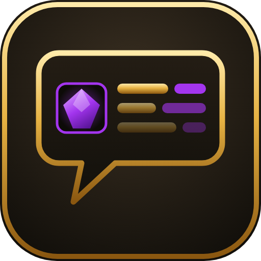

<p align="center">
  
</p>

<h1 align="center">Simple Loot Info</h1>

<p align="center">
  Adds configurable item type, equipment slot, item level, secondary/tertiary stats, icons and loot evaluation labels to gear links in chat.
</p>

<p align="center">
  
  
</p>

---

## What it does

When somebody links a piece of gear, you normally have to hover over it to find out
whether it is even relevant to you. Simple Loot Info answers that question inline.

**Before**

```
You receive loot: [Sabatons of the Silent Vigil]
```

**After**

```
You receive loot: Plate/Legs/639: [Sabatons of the Silent Vigil] (Haste 120/Critical Strike 95) (Leech 48) [Suitable] [iLvl +8]
```

The format is `Type/Slot/ItemLevel: [link] (Secondary Stat/Secondary Stat)`, where *Type* is the item's subtype — the
armor class for armor (`Plate`, `Leather`, …) and the weapon class for weapons
(`Sword`, `Staff`, …). Secondary stats are sorted from highest to lowest and use the
client's localized stat names. Whatever the client cannot resolve yet is simply left
out, so you never get a broken decoration.

Rare tertiary stats are placed in a separate, gold-highlighted group after the normal
secondary stats. Leech, Avoidance and Speed include their rating; Indestructible is
shown without the API's internal boolean value.

For `CHAT_MSG_LOOT`, the addon can append suitability and item-level comparison labels
to the end of the complete enhanced output. The existing type, slot, item level and
stat decoration stays intact. Ordinary chat keeps that existing enhancement, but does
not receive the loot-only evaluation labels.

### Loot evaluation labels

The loot-only labels combine color with text, so their meaning remains readable even
when color alone is hard to distinguish:

| Label | Meaning |
| --- | --- |
| `Suitable` | The item can be equipped and matches the current specialization. |
| `Not for Current Spec` | The item can be equipped, but its primary-stat/spec combination is not intended for the current specialization. |
| `Cannot Equip` | The current character cannot equip the item. |
| `iLvl +N` / `iLvl -N` | The item is N item levels higher/lower than the equipped item in the corresponding slot. |
| `Same iLvl` | The item and the equipped comparison item have the same item level. |
| `Empty Slot` | There is no equipped item in the corresponding slot to compare against. |
| `Item Level Unknown` | The client does not have enough detailed candidate or equipped item-level data to make a reliable comparison yet. |
| `Weapon Setup` | A one-hand/two-hand transition affects both weapon slots, so a one-slot item-level result would be misleading. |

Suitability and item-level labels are independent settings. Either can be disabled
without changing the normal chat-link decoration.

## Features

- Works on loot messages **and** on links other players post in chat.
- Only touches weapons and armor. Consumables, quest items, crafting mats and
  everything else are left untouched.
- Shows Critical Strike, Haste, Mastery and Versatility after the link, sorted from
  highest to lowest in the regular secondary-stat group.
- Detects Leech, Avoidance, Speed and Indestructible separately and highlights them in
  gold so rare tertiary rolls stand out immediately.
- Appends loot-only `Suitable`, `Not for Current Spec`, `Cannot Equip`, `iLvl +/-`,
  `Same iLvl`, `Empty Slot`, `Item Level Unknown` or `Weapon Setup` labels after the
  existing complete output.
- Uses both color and text for every loot evaluation result, keeping the labels
  readable without relying on color alone.
- Lets you independently show or hide item type, equipment slot, item level, secondary
  stats, tertiary stats and an inline item icon.
- Loot messages and ordinary chat can be enabled separately.
- Settings persist across sessions, with commands to inspect or reset them.
- Localized slot names — the addon reads them from the game client, so `Legs` shows up
  as `腿部` on a Chinese client, `Beine` on a German one, and so on.
- Pure chat filter. No UI frames, no taint and only a tiny saved settings table.
- Registers its filters ~2 seconds after login on purpose, so it layers cleanly on top
  of other chat and item-link addons instead of fighting them.

## Monitored channels

| Category | Events |
| --- | --- |
| Loot | `CHAT_MSG_LOOT` |
| Local | Say, Yell |
| Group | Party, Party Leader, Raid, Raid Leader |
| Instance | Instance Chat, Instance Chat Leader |
| Guild | Guild, Officer |
| Private | Whisper, Whisper Inform |
| Other | Custom channels |

## Installation

**CurseForge App** — search for *Simple Loot Info* and hit Install.

**Manual** — download the release zip and extract it so the folder structure is:

```
World of Warcraft/_retail_/Interface/AddOns/SimpleLootInfo/
├── Chat.lua
├── Commands.lua
├── Evaluation.lua
├── ItemLink.lua
├── SimpleLootInfo.lua
└── SimpleLootInfo.toc
```

Then `/reload` or restart the client.

## Commands

| Command | Description |
| --- | --- |
| `/sli` | Show the command list |
| `/sli on` / `/sli off` | Enable or disable all enhancements |
| `/sli type [on\|off]` | Toggle item type |
| `/sli slot [on\|off]` | Toggle equipment slot |
| `/sli ilvl [on\|off]` | Toggle item level |
| `/sli secondary [on\|off]` | Toggle secondary stats after the link (`stats` is an alias) |
| `/sli tertiary [on\|off]` | Toggle highlighted tertiary stats after the secondary stats |
| `/sli icon [on\|off]` | Toggle a 14px inline item icon |
| `/sli suitable [on\|off]` | Toggle loot-only suitability labels (`Suitable`, `Not for Current Spec`, `Cannot Equip`) |
| `/sli upgrade [on\|off]` | Toggle loot-only item-level comparison labels (`iLvl +/-`, `Same iLvl`, `Empty Slot`, `Item Level Unknown`, `Weapon Setup`) |
| `/sli loot [on\|off]` | Toggle enhancements in loot messages |
| `/sli chat [on\|off]` | Toggle enhancements in ordinary chat |
| `/sli status` | Show the current configuration |
| `/sli reset` | Restore the default configuration |
| `/sli debug [on\|off]` | Toggle debug output for the current session |

Debug mode is the first thing to try if a link is not being decorated — it will tell you
whether the item was skipped as non-equipment or whether the item data had not been
cached yet.

## Compatibility

Built against Interface `120100` (Retail). It uses `C_Item.GetItemInfoInstant`,
`C_Item.GetDetailedItemLevelInfo`, `C_Item.GetItemStats`, `C_Item.GetItemSpecInfo`,
`C_PlayerInfo.CanUseItem`, the specialization APIs and equipped inventory links. The
normal decoration keeps its `GetItemInfo` item-level fallback, while upgrade labels
require detailed item levels so a base level cannot be mistaken for an upgrade. Item
data is requested asynchronously when the client has not cached it yet.

## Publishing a release

Update `## Version` in `SimpleLootInfo.toc` whenever addon code changes. After a commit
that modifies any top-level addon Lua file or `SimpleLootInfo.toc` is merged into
`main`, the release workflow automatically creates the matching tag and GitHub Release.

For example, TOC version `1.4.0` produces `SimpleLootInfo-v1.4.0.zip` with the required
`SimpleLootInfo/` directory structure and automatically generated release notes. If
release `v1.4.0` already exists, the workflow stops and requires another version bump.
Changes limited to documentation, tests or repository configuration do not publish a
new addon version.

## Known limitations

- The very first time you see an item in a session, the client may not have its data
  cached. The addon requests it in the background, so a subsequent link of the same item
  will be decorated correctly.
- One-hand/two-hand transitions are labeled `Weapon Setup` instead of receiving a
  potentially misleading single-slot item-level comparison.
- Only weapons (class ID 2) and armor (class ID 4) are decorated. This is intentional.

## License

MIT — see [LICENSE](LICENSE).
